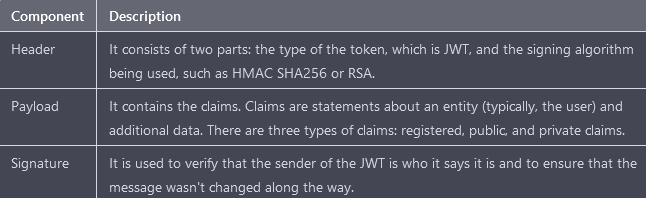

# API Blue Print

## Introduction

APIs, or application programming interfaces, are a fundamental part of modern software development. They enable different systems or applications to communicate with each other, allowing clients to access resources from a provider's API endpoint. In this module, we will explore the structure of APIs, including the different types, formats, and methods of authentication that are commonly used.

## Types of APIs

APIs come in different types, each with its own set of rules, functions, and purposes. Two of the most common types are RESTful APIs and GraphQL.

> Note: That being said, it's important to note that another type of API, less popular nowadays, is the SOAP API. SOAP APIs are not old, but they are not as widely used as they used to be. The rise of RESTful APIs has led to a decline in the use of SOAP APIs as RESTful APIs are considered more lightweight, flexible, and easier to use. While SOAP APIs may not be the best choice for all use cases, they can still provide valuable solutions in certain situations, and they are still in use in certain industries, such as finance and government, where security and reliability are top priorities.

### RESTful API
RESTful APIs, or Representational State Transfer APIs, use a set of architectural constraints that are based on HTTP methods. They follow the CRUD (Create, Read, Update, Delete) principles and have a uniform interface, client-server architecture, stateless communication, and cacheable responses. RESTful APIs are designed to improve upon the inefficiencies of other older APIs. They rely entirely on the use of HTTP, which makes them more approachable for end-users. RESTful APIs use standard HTTP methods such as GET, POST, PUT, and DELETE to accomplish CRUD operations. The main advantage of RESTful APIs is their simplicity, ease of use, and flexibility. They can be used with any programming language and can be accessed by any client that can make HTTP requests.

A sample GET Request and Response:

https://official-joke-api.appspot.com/random_joke

Request
```
Accept	text/html,application/xhtml+xml,application/xml;q=0.9,image/avif,image/webp,*/*;q=0.8
Accept-Encoding	gzip, deflate, br
Accept-Language	en-US,en;q=0.5
Connection	keep-alive
Host	official-joke-api.appspot.com
Referer	https://apipheny.io/
Sec-Fetch-Dest	document
Sec-Fetch-Mode	navigate
Sec-Fetch-Site	cross-site
Sec-Fetch-User	?1
Sec-GPC	1
Upgrade-Insecure-Requests	1
User-Agent	Mozilla/5.0 (Windows NT 10.0; Win64; x64; rv:109.0) Gecko/20100101 Firefox/109.0
```
Response
```
X-Firefox-Spdy	h2
access-control-allow-origin	*
alt-svc	h3=":443"; ma=2592000,h3-29=":443"; ma=2592000,h3-Q050=":443"; ma=2592000,h3-Q046=":443"; ma=2592000,h3-Q043=":443"; ma=2592000,quic=":443"; ma=2592000; v="46,43"
cache-control	private
content-encoding	gzip
content-length	133
content-type	application/json; charset=utf-8
date	Wed, 25 Jan 2023 19:08:19 GMT
etag	W/"76-RD4Rs4NcAOZor8D/5Ob8LyRlna4"
server	Google Frontend
vary	Accept-Encoding
x-cloud-trace-context	ecf605766b676b2442691d646c2b4e24
x-powered-by	Express
```
JSON

```
type	"programming"
setup	"What did the Java code say to the C code?"
punchline	"You've got no class."
id	387
```

### GraphQL API
GraphQL, short for Graph Query Language, is a specification for APIs that allows clients to define the structure of the data they want to request from the server. GraphQL APIs are query-centric, similar to a database query language like SQL, and store resources in a graph data structure. This allows clients to request exactly the data they need, reducing the amount of data that needs to be sent over the network, and reducing the complexity of the client-side code. GraphQL also uses HTTP, typically depending on a single entry point using the POST method. GraphQL uses three operations within the POST request to interact with GraphQL APIs: query, mutation, and subscription. The query operation is used to retrieve data (read), the mutation operation is used to submit and write data (create, update, and delete), and the subscription operation is used to send data (for read actions) when an event occurs. Subscription allows GraphQL clients to listen to live updates from the server, which is useful in applications that require real-time data.

A sample POST Request and Response:

Request
```
POST /graphql HTTP/1.1
Host: local:8083
Content-Type: application/graphql
Cache-Control: no-cache
Authorization: Bearer APIKEY
{query{
        FindAllGames(_id:00012, title:"HALO"){
        _id
        title
        fields{
        price}
        }
    }
 }
```
Response
```
HTTP/1.1 200 OK
Content-Type: application/json
Server: BEServer
{
"data": { 
"FindAllGames": { "_id": "Graphics Card",
"fields": [
{
"price":"45.00"
    ] } }
}
```
Both RESTful and GraphQL APIs have their own strengths and best use cases. RESTful APIs are simple, flexible, and widely adopted, making them a good choice for simple use cases and for building simple APIs. GraphQL, on the other hand, is better suited for more complex use cases, where clients need more control over the data they receive, and for building more powerful and flexible APIs. Understanding the differences between the two can help developers choose the right API type for their use case.

## Data Interchange Formats

APIs use several formats to facilitate the exchange of data. Additionally, specifications use these formats to document APIs. Some APIs, like SOAP, require a specific format, whereas others allow the client to specify the format to use in the request and response body. The three common formats that are used in APIs are JSON, XML, and YAML.

JSON (JavaScript Object Notation) is the primary data interchange format used for APIs. It is widely used because it is human-readable and easily parsable by applications. JSON organizes data in a way that is both human-readable and easily parsable by applications; many programming languages can turn JSON into data types they can use. JSON represents objects as key/value pairs separated by commas, within a pair of curly brackets.

Samples:
```
// api/config/default.json`

{
  "host": "localhost",
  "port": 3030,
  "public": "../public/",
  "paginate": {
    "default": 10,
    "max": 50
  },
  "mongodb": "mongodb://localhost:27017/api"
}
```
Valid Data Types

In JSON, values must be one of the following data types:

```
Type     |  Example
-----------------------------------------------------------------------
a string    {"name":"John"}
a number    {"age":30}
an object   {"employee":{"name":"John", "age":30, "city":"New York"}}
an array    {"employees":["John", "Anna", "Peter"]}
a boolean   {"sale":true}
null        {"middlename":null}
```

XML (Extensible Markup Language) is another format that is commonly used in APIs. It is a markup language that uses tags to define elements and attributes to define properties of those elements. XML is more verbose than JSON and is less commonly used in modern web development.

Samples:

```
<breakfast_menu>
<food>
<name>Belgian Waffles</name>
<price>$5.95</price>
<description>Two of our famous Belgian Waffles with plenty of real maple syrup</description>
<calories>650</calories>
</food>
<food>
<name>Strawberry Belgian Waffles</name>
<price>$7.95</price>
<description>Light Belgian waffles covered with strawberries and whipped cream</description>
<calories>900</calories>
</food>
<food>
<name>Berry-Berry Belgian Waffles</name>
<price>$8.95</price>
<description>Light Belgian waffles covered with an assortment of fresh berries and whipped cream</description>
<calories>900</calories>
</food>
<food>
<name>French Toast</name>
<price>$4.50</price>
<description>Thick slices made from our homemade sourdough bread</description>
<calories>600</calories>
</food>
<food>
<name>Homestyle Breakfast</name>
<price>$6.95</price>
<description>Two eggs, bacon or sausage, toast, and our ever-popular hash browns</description>
<calories>950</calories>
</food>
</breakfast_menu>
```

YAML (YAML Ain’t Markup Language) is another lightweight form of data exchange used in APIs. It was created as a more human- and computer-readable format for data exchange. Like JSON, YAML documents contain key/value pairs. The value may be any of the YAML data types, which include numbers, strings, Booleans, null values, and sequences. YAML is much more readable than JSON. YAML documents begin with --- and end with ... instead of with curly brackets. Also, quotes around strings are optional. Additionally, URLs don’t need to be encoded with backslashes. Finally, YAML uses indentation instead of curly brackets to represent nesting and allows for comments beginning with #.

Samples:
```
---  # yaml document beginning
# comment syntax

# basic syntax - key and value separated by colon and space before the value
key: value

# Scalar data types
integerValue: 1                     # integer value
floatingValue: 1                     # floating vale

stringValue: "456"                   # string with double quotes
stringValue: 'abc'                  # string with single quotes
stringValue: wer                   # string without quotes

booleanValue:true                   # boolean values - true or false


# Multiline string with literal block syntax -preserved new lines
string1: |
   Line1
   line2
   "line3"   
  line4

# Multiline strings with folded block syntax - new lines are not preserved, leading and trailing spaces are ignore
  string1: >
   Line1
   line2
   "line3"   
  line4
# Collection sequence data types
 # sequence arraylist example
 - One
 - two
 - Three

  # another way of sequence  syntax example
  [one, two , three]

### dictionary
  mysqldatabase:
    hostname: localhost
    port: 3012
    username: root
    password: root
```

## Authentication Methods

The simplest form of API authentication is HTTP basic authentication, in which the consumer includes their username and password in a header or the body of a request - Not the best, neither recommended.

API keys are unique strings that API providers generate and grant to authorize access for approved consumers. Once an API consumer has a key, they can include it in requests whenever specified by the provider. The provider will typically require that the consumer pass the key in query string parameters, request headers, body data, or as a cookie when they make a request. API keys can be more secure than basic authentication for several reasons. When keys are sufficiently long, complex, and randomly generated, they can be exceedingly difficult for an attacker to guess or brute-force. Additionally, providers can set expiration dates to limit the length of time for which the keys are valid. However, API keys have several associated risks that can be exploited by hackers. Since each API provider may have their own system for generating API keys, hackers may be able to guess or forge API keys by learning about the API consumers. Additionally, API keys may be exposed to the internet in online repositories, left in code comments, intercepted when transferred over unencrypted connections, or stolen through phishing.

Another method of API authentication is using JSON Web Tokens (JWT). JWT is a type of token commonly used in API token-based authentication. The process of acquiring a JWT token consists of the consumer authenticating to the API provider with a username and password, the provider then generates a JWT and sends it back to the consumer, and the consumer then adds the JWT to the Authorization header in all API requests. JWTs consist of three parts, all of which are base64-encoded and separated by periods: the header, the payload, and the signature. The header includes information about the algorithm used to sign the payload, the payload includes data such as the username, timestamp, and issuer, and the signature is the encoded and encrypted message used to validate the token. JWTs are generally secure but can be implemented in ways that will compromise that security. For example, if the token is not encrypted, an attacker could decode the token, tamper with the contents, and send it back to the provider to gain access.



It will look like this:
> xxxxx.yyyyy.zzzzz where xxxxx is encoded header, yyyyy is encoded payload and zzzzz is the signature.

A Hash-based Message Authentication Code (HMAC) is another method of API authentication. It is the primary API authentication method used by Amazon Web Services (AWS). The process of acquiring an HMAC token consists of the provider creating a secret key and sharing it with the consumer. When the consumer interacts with the API, an HMAC hash function is applied to the consumer's API request data and secret key. The resulting hash (also called a message digest) is added to the request and sent to the provider. The provider calculates the HMAC, just as the consumer did, by running the message and key through the hash function, and then compares the output hash value to the value provided by the client. If the provider's hash value matches the consumer's hash value, the consumer is authorized to make the request. If the values do not match, either the client's secret key is incorrect, or the message has been tampered with. The security of the message digest depends on the cryptographic strength of the hash function and secret key. Stronger hash mechanisms typically produce longer hashes.

OAuth 2.0 is an open standard for authorization that allows users to share their private resources (e.g. data stored on one site) with a third-party application or website without sharing their credentials (e.g. username and password). It enables a third-party application or website to obtain limited access to a user's resources on an HTTP service (such as Facebook, Google, etc.). OAuth 2.0 is an authorization framework that enables applications to obtain limited access to user accounts on an HTTP service. It works by allowing users to authorize a client application to access their resources on an HTTP service without sharing their credentials.
An example of how OAuth 2.0 works is as follows:

    1.  A user wants to give a third-party application access to their data stored on a social media  platform (e.g. Facebook).

    2.  The third-party application redirects the user to the social media platform's authorization server.

    3.  The user logs in to the authorization server using their social media account credentials and grants the third-party application access to their data.

    4.  The authorization server generates an access token and sends it to the third-party application.

    5.  The third-party application uses the access token to make authorized requests to the social media platform's resource server to access the user's data.

    6.  The resource server returns the requested data to the third-party application, which can then display it to the user.

In this example, the user's social media account credentials are never shared with the third-party application, and the access token has a limited lifespan and scope of access, providing an added layer of security.
## Common security weaknesses

APIs, similar to other applications, are not immune to vulnerabilities. Some of the most common security weaknesses that attackers leverage and exploit to hack APIs include:
- Injection attacks: This type of attack occurs when an attacker injects malicious code into an API's input fields, such as SQL injection, where the attacker can gain access to sensitive data stored in the database.
- Insufficient authentication and access control: APIs that do not have proper authentication and access controls in place are vulnerable to unauthorized access and use by attackers.
- Weak or easily guessable API keys: APIs that use easily guessable or weak keys can be easily compromised by attackers.
- Lack of encryption: APIs that do not use encryption to protect sensitive data in transit and storage are vulnerable to eavesdropping and data breaches.
- Broken object-level authorization: APIs that have poor object-level authorization controls can be exploited by attackers to access or manipulate sensitive data.
- Lack of logging and monitoring: APIs that do not log and monitor access and usage are vulnerable to attacks that go unnoticed.
- Inadequate input validation: APIs that do not properly validate input data can be exploited by attackers to inject malicious data and gain unauthorized access.
- Insecure communication: APIs that do not use secure protocols for communication such as HTTPS can be intercepted and manipulated by attackers.
- Lack of API rate limiting: APIs that do not have rate limiting in place can be subject to DDoS attacks and other types of abuse.
- Lack of API versioning: APIs that do not have proper versioning in place can be vulnerable to attacks targeting known vulnerabilities in older versions.
- Lack of API documentation: APIs that lack proper documentation make it harder for developers to understand the intended use of the API and may lead to insecure usage.
- Lack of proper testing: APIs that have not been properly tested are more likely to contain security vulnerabilities.
- Lack of proper API lifecycle management: APIs that are not properly managed throughout their lifecycle can become obsolete and unsecure over time.
Note: It's important to note that this is not an exhaustive list, as new types of attacks and vulnerabilities continue to emerge.

### In conclusion

APIs play an important role in modern software development and come in different types such as RESTful and GraphQL. They use different formats like JSON, XML, YAML to facilitate data exchange. Additionally, APIs use different methods of authentication like API keys, JWT and HMAC to ensure that only authorized users can access the resources. As an API developer or consumer, it is important to understand these different aspects of APIs in order to make informed decisions and ensure the security of the API.

<p align="center">
        
</p>

<p align="center">
    📖 <b><a href="https://github.com/gastori/api_security/raw/main/module_2_api_bp/pptx/api_bp.pptx">PowerPoint Deck</a></b> 
</p>

<p align="center">
    🙌 VIDEO IS WORKING IN PROGRESS - STAY TUNED   
</p>

